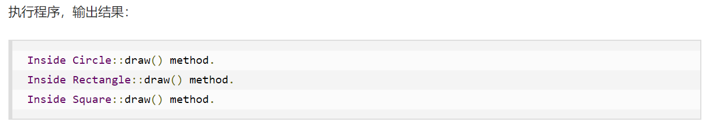
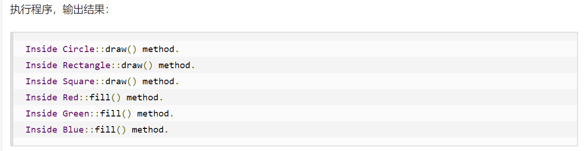
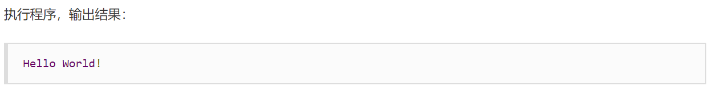
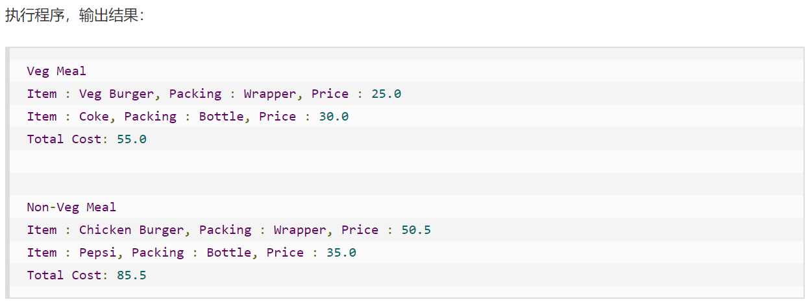

[TOC]

## 0. 博客

```html
https://www.runoob.com/design-pattern/design-pattern-tutorial.html
```

## 1. Factory Method（工厂方法模式）

实现过程：共同功能抽象化成一个接口，根据需求，通过工厂返回想要的实现类。

### 1.1 共同接口

```java
public interface Shape {
   void draw();
}
```

### 1.2 同个接口不同实现类

```java
// Rectangle.java
public class Rectangle implements Shape {
 
   @Override
   public void draw() {
      System.out.println("Inside Rectangle::draw() method.");
   }
}

// Square.java
public class Square implements Shape {
 
   @Override
   public void draw() {
      System.out.println("Inside Square::draw() method.");
   }
}

// Circle.java
public class Circle implements Shape {
 
   @Override
   public void draw() {
      System.out.println("Inside Circle::draw() method.");
   }
}
```

### 1.3 创建工厂

```java
public class ShapeFactory {
    
   //使用 getShape 方法获取形状类型的对象
   public Shape getShape(String shapeType){
      if(shapeType == null){
         return null;
      }        
      if(shapeType.equalsIgnoreCase("CIRCLE")){
         return new Circle();
      } else if(shapeType.equalsIgnoreCase("RECTANGLE")){
         return new Rectangle();
      } else if(shapeType.equalsIgnoreCase("SQUARE")){
         return new Square();
      }
      return null;
   }
}
```

### 1.4 测试

 **说明：通过代码可以看出通过不同的构造函数获取不同的实体**

```java
public class FactoryPatternDemo {
 
   public static void main(String[] args) {
      ShapeFactory shapeFactory = new ShapeFactory();
 
      //获取 Circle 的对象，并调用它的 draw 方法
      Shape shape1 = shapeFactory.getShape("CIRCLE");
 
      //调用 Circle 的 draw 方法
      shape1.draw();
 
      //获取 Rectangle 的对象，并调用它的 draw 方法
      Shape shape2 = shapeFactory.getShape("RECTANGLE");
 
      //调用 Rectangle 的 draw 方法
      shape2.draw();
 
      //获取 Square 的对象，并调用它的 draw 方法
      Shape shape3 = shapeFactory.getShape("SQUARE");
 
      //调用 Square 的 draw 方法
      shape3.draw();
   }
}
```




## 2. 抽象工厂模式（Abstract Factory Pattern）

  **说明：与工厂模式差不多，区别在于，抽象工厂是把一整套的东西抽象化，不是单一一件，比如整套衣服，分为衣服以及裤子，抽象工厂模式融合衣服和裤子的抽象，放入到一个抽象模式。**

### 2.1 共同接口

```java
// 形状接口
public interface Shape {
   void draw();
}
```

```java
// 颜色接口
public interface Color {
   void fill();
}
```

### 2.2 同个接口不同实现类

```java
// Rectangle.java
public class Rectangle implements Shape {
 
   @Override
   public void draw() {
      System.out.println("Inside Rectangle::draw() method.");
   }
}

// Square.java
public class Square implements Shape {
 
   @Override
   public void draw() {
      System.out.println("Inside Square::draw() method.");
   }
}

// Circle.java
public class Circle implements Shape {
 
   @Override
   public void draw() {
      System.out.println("Inside Circle::draw() method.");
   }
}
```


```java
// Red.java
public class Red implements Color {
 
   @Override
   public void fill() {
      System.out.println("Inside Red::fill() method.");
   }
}

// Green.java
public class Green implements Color {
 
   @Override
   public void fill() {
      System.out.println("Inside Green::fill() method.");
   }
}

// Blue.java
public class Blue implements Color {
 
   @Override
   public void fill() {
      System.out.println("Inside Blue::fill() method.");
   }
}
```

### 2.3 抽象工厂抽象类（关键）

```java
public abstract class AbstractFactory {
   public abstract Color getColor(String color);
   public abstract Shape getShape(String shape) ;
}
```

### 2.4 工厂抽象类实现类（关键）

```java
public class ShapeFactory extends AbstractFactory {
    
   @Override
   public Shape getShape(String shapeType){
      if(shapeType == null){
         return null;
      }        
      if(shapeType.equalsIgnoreCase("CIRCLE")){
         return new Circle();
      } else if(shapeType.equalsIgnoreCase("RECTANGLE")){
         return new Rectangle();
      } else if(shapeType.equalsIgnoreCase("SQUARE")){
         return new Square();
      }
      return null;
   }
   
   @Override
   public Color getColor(String color) {
      return null;
   }
}
```

```java
public class ColorFactory extends AbstractFactory {
    
   @Override
   public Shape getShape(String shapeType){
      return null;
   }
   
   @Override
   public Color getColor(String color) {
      if(color == null){
         return null;
      }        
      if(color.equalsIgnoreCase("RED")){
         return new Red();
      } else if(color.equalsIgnoreCase("GREEN")){
         return new Green();
      } else if(color.equalsIgnoreCase("BLUE")){
         return new Blue();
      }
      return null;
   }
}
```

### 2.5 工厂创建类

```java
public class FactoryProducer {
   public static AbstractFactory getFactory(String choice){
      if(choice.equalsIgnoreCase("SHAPE")){
         return new ShapeFactory();
      } else if(choice.equalsIgnoreCase("COLOR")){
         return new ColorFactory();
      }
      return null;
   }
}
```

### 2.6 测试

```java
public class AbstractFactoryPatternDemo {
   public static void main(String[] args) {
 
      //获取形状工厂
      AbstractFactory shapeFactory = FactoryProducer.getFactory("SHAPE");
 
      //获取形状为 Circle 的对象
      Shape shape1 = shapeFactory.getShape("CIRCLE");
 
      //调用 Circle 的 draw 方法
      shape1.draw();
 
      //获取形状为 Rectangle 的对象
      Shape shape2 = shapeFactory.getShape("RECTANGLE");
 
      //调用 Rectangle 的 draw 方法
      shape2.draw();
      
      //获取形状为 Square 的对象
      Shape shape3 = shapeFactory.getShape("SQUARE");
 
      //调用 Square 的 draw 方法
      shape3.draw();
 
      //获取颜色工厂
      AbstractFactory colorFactory = FactoryProducer.getFactory("COLOR");
 
      //获取颜色为 Red 的对象
      Color color1 = colorFactory.getColor("RED");
 
      //调用 Red 的 fill 方法
      color1.fill();
 
      //获取颜色为 Green 的对象
      Color color2 = colorFactory.getColor("Green");
 
      //调用 Green 的 fill 方法
      color2.fill();
 
      //获取颜色为 Blue 的对象
      Color color3 = colorFactory.getColor("BLUE");
 
      //调用 Blue 的 fill 方法
      color3.fill();
   }
}
```




## 3. 单例模式（Singleton Pattern)

 **说明：主要解决一个全局使用的类频繁地创建与销毁**

### 3.1 创建单例类

```java
public class SingleObject {
 
   //创建 SingleObject 的一个对象
   private static SingleObject instance = new SingleObject();
 
   //让构造函数为 private，这样该类就不会被实例化
   private SingleObject(){}
 
   //获取唯一可用的对象
   public static SingleObject getInstance(){
      return instance;
   }
 
   public void showMessage(){
      System.out.println("Hello World!");
   }
}
```

### 3.2 测试

```java
public class SingletonPatternDemo {
   public static void main(String[] args) {
 
      //不合法的构造函数
      //编译时错误：构造函数 SingleObject() 是不可见的
      //SingleObject object = new SingleObject();
 
      //获取唯一可用的对象
      SingleObject object = SingleObject.getInstance();
 
      //显示消息
      object.showMessage();
   }
}
```



### 3.3 多种类型单例模式

[博客]: https://www.runoob.com/design-pattern/singleton-pattern.html


## 4. 建造者模式（Builder Pattern）

 **说明：主要解决固定成员不同搭配问题。比如肯德基，汉堡，薯条等等是固定的，但是套餐确实不固定的。**

### 4.1 创建固定成员接口

```java
// 表示食物条目和食物包装的接口
public interface Item {
   public String name();
   public Packing packing();
   public float price();    
}

public interface Packing {
   public String pack();
}
```

### 4.2 实现接口

```java
// 两种打包方式
public class Wrapper implements Packing {
 
   @Override
   public String pack() {
      return "Wrapper";
   }
}

public class Bottle implements Packing {
 
   @Override
   public String pack() {
      return "Bottle";
   }
}

// 食物抽象类
public abstract class Burger implements Item {
 
   @Override
   public Packing packing() {
      return new Wrapper();
   }
 
   @Override
   public abstract float price();
}

public abstract class ColdDrink implements Item {
 
    @Override
    public Packing packing() {
       return new Bottle();
    }
 
    @Override
    public abstract float price();
}
```


### 4.3 具体构造类

```java
// 各种食物实现类
public class VegBurger extends Burger {
 
   @Override
   public float price() {
      return 25.0f;
   }
 
   @Override
   public String name() {
      return "Veg Burger";
   }
}


public class ChickenBurger extends Burger {
 
   @Override
   public float price() {
      return 50.5f;
   }
 
   @Override
   public String name() {
      return "Chicken Burger";
   }
}

public class Coke extends ColdDrink {
 
   @Override
   public float price() {
      return 30.0f;
   }
 
   @Override
   public String name() {
      return "Coke";
   }
}

public class Pepsi extends ColdDrink {
 
   @Override
   public float price() {
      return 35.0f;
   }
 
   @Override
   public String name() {
      return "Pepsi";
   }
}
```

### 4.4 创建集合对象

```
import java.util.ArrayList;
import java.util.List;
 
public class Meal {
   private List<Item> items = new ArrayList<Item>();    
 
   public void addItem(Item item){
      items.add(item);
   }
 
   public float getCost(){
      float cost = 0.0f;
      for (Item item : items) {
         cost += item.price();
      }        
      return cost;
   }
 
   public void showItems(){
      for (Item item : items) {
         System.out.print("Item : "+item.name());
         System.out.print(", Packing : "+item.packing().pack());
         System.out.println(", Price : "+item.price());
      }        
   }    
}
```

### 4.5 建造者创建具体对象

```java
public class MealBuilder {
 
   public Meal prepareVegMeal (){
      Meal meal = new Meal();
      meal.addItem(new VegBurger());
      meal.addItem(new Coke());
      return meal;
   }   
 
   public Meal prepareNonVegMeal (){
      Meal meal = new Meal();
      meal.addItem(new ChickenBurger());
      meal.addItem(new Pepsi());
      return meal;
   }
}
```

### 4.6 测试

```java
public class BuilderPatternDemo {
   public static void main(String[] args) {
      MealBuilder mealBuilder = new MealBuilder();
 
      Meal vegMeal = mealBuilder.prepareVegMeal();
      System.out.println("Veg Meal");
      vegMeal.showItems();
      System.out.println("Total Cost: " +vegMeal.getCost());
 
      Meal nonVegMeal = mealBuilder.prepareNonVegMeal();
      System.out.println("\n\nNon-Veg Meal");
      nonVegMeal.showItems();
      System.out.println("Total Cost: " +nonVegMeal.getCost());
   }
}
```




## 5. 原型模式（Prototype Pattern)

