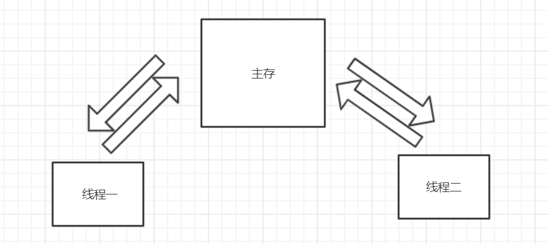
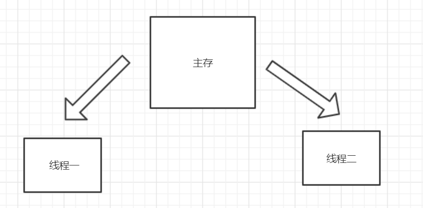
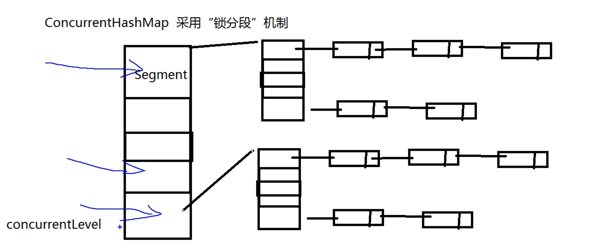
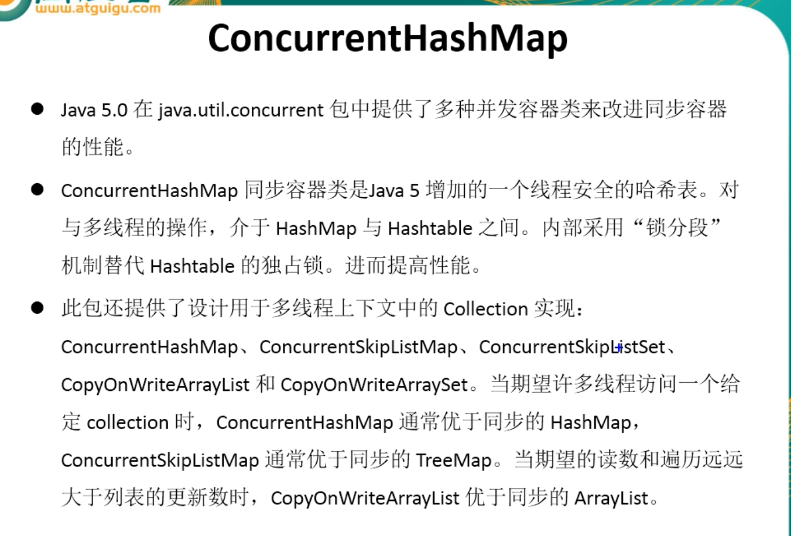
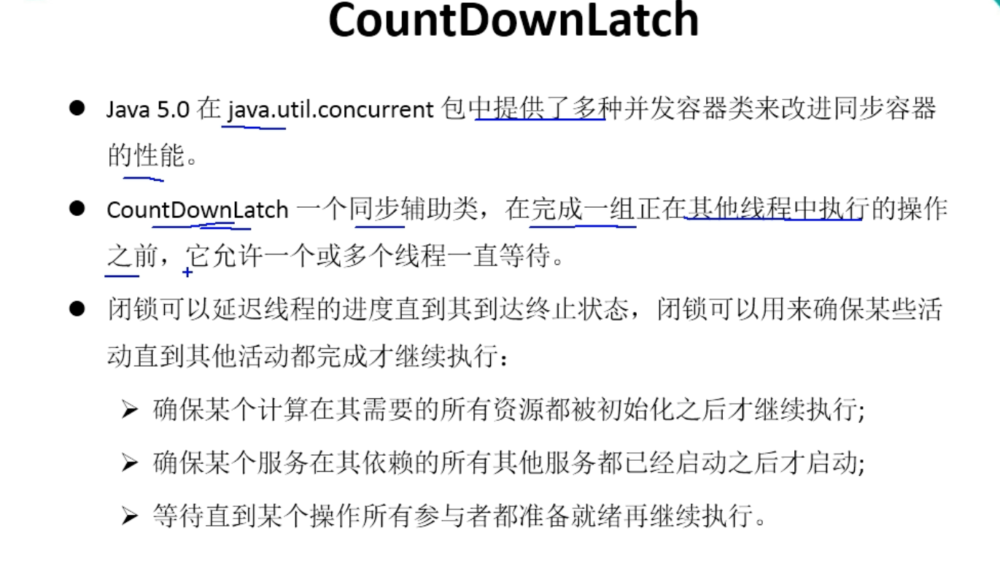

# volatile

## 概括

解决问题：

1.解决了内存不可见问题。

无法解决问题：

1.原子性问题

2互斥性问题


## 如何解决问题： 内存不可见问题

前提假设有两个线程。

没有volatile关键词，之前的做法是，所有线程的数据都是从主存上拿，处理后返回给主存.主存在更新变量



**假设拿取数据速度一样快，线程一处理速度相对更快。**

这样会导致一个问题，线程一向主存获取值，线程二同时也向主存获取值，但是会出现一个问题。线程一处理结果返回给主存，线程二理论上应该是处理（线程一的基础上在处理返回主存）。因此出现处理错误。

**加上修饰词voliate处理方式变成**



线程一与线程二同时对主存进行操作，当主存的值改变的时候线程二也同时在改变。解决了线程不可见问题.


## 无法解决的问题

**原子性问题**

线程不只是一个操作,比如 i++,可以拆分成两个步骤  cash = i + 1; i = cash;

如果线程一在进行i++操作时进行完 cash = i + 1,此时的 i 还是初始值.

线程二拿取的还是初始值,进行计算进行步骤一,此时线程二进行完步骤二,i值更新!

此时线程二,进行第二步骤,讲计算后的值赋值给主存.没有达到线程目的.

**锁住其他线程行为进行**

通过上述描述,线程二和线程一可以同时进行,并没有锁住主存里的数据.


## 解决线程安全问题方案: CAS (compara AND switch)

实现原理:

​	当一个线程向主存读取一个数据,进行计算的时候,把他当作一个过去值v

​    线程完成操作行为后再次读取值,对比初始值与过去值是否相同,

​	如果相同,则结果计算的值替换掉主存值, 不同则取消线程这一次计算行为.


# 同步容器

## ConcurrentHashMap工作原理

### 工作原理: 

**concurrentLever默认值16,表示有16个分段**



## java.util.current



## CopyOnWriteArrayList:解决并发修改异常问题

### CopyOnWriteArrayList使用与对照

**问题描述:在程序并发读取的过程中.例如用迭代器读取数据,边读取边插入数据会导致修改异常问题报错发生.而CopyOnWriteArrayList就是用来解决这个问题.**

```java
/*
 * CopyOnWriteArrayList/CopyOnWriteArraySet : “写入并复制” 注意：添加操作多时，效率低，因为每次添加时都会进行复制，开销非常的大。并发迭代操作多时可以选择。
 */
public class TestCopyOnWriteArrayList {

    public static void main(String[] args) {
        HelloThread ht = new HelloThread();
        for (int i = 0; i < 10; i++) {
            new Thread(ht).start();
        }
    }

}

class HelloThread implements Runnable {
    // 如果使用这个,则会报异常,无法做到边读取便插入数据
    // private static List<String> list = Collections.synchronizedList(new ArrayList<String>());

    private static CopyOnWriteArrayList<String> list = new CopyOnWriteArrayList<>();

    static {
        list.add("AA");
        list.add("BB");
        list.add("CC");
    }

    @Override
    public void run() {
        Iterator<String> it = list.iterator();
        while (it.hasNext()) {
            System.out.println(it.next());
            list.add("AA");
        }
    }
}		
```

## Callable实现线程调用

```java
/*
 * 一、创建执行线程的方式三：实现 Callable 接口。 相较于实现 Runnable 接口的方式，方法可以有返回值，并且可以抛出异常。
 * 
 * 二、执行 Callable 方式，需要 FutureTask 实现类的支持，用于接收运算结果。  FutureTask 是  Future 接口的实现类
 */
public class TestCallable {
	
	public static void main(String[] args) {
		ThreadDemo td = new ThreadDemo();
		
		//1.执行 Callable 方式，需要 FutureTask 实现类的支持，用于接收运算结果。
		FutureTask<Integer> result = new FutureTask<>(td);
		
		new Thread(result).start();
		
		//2.接收线程运算后的结果
		try {
			Integer sum = result.get();  //FutureTask 可用于 闭锁
			System.out.println(sum);
			System.out.println("------------------------------------");
		} catch (InterruptedException | ExecutionException e) {
			e.printStackTrace();
		}
	}

}

class ThreadDemo implements Callable<Integer>{

	@Override
	public Integer call() throws Exception {
		int sum = 0;
		
		for (int i = 0; i <= 100000; i++) {
			sum += i;
		}
		
		return sum;
	}
	
}

/*class ThreadDemo implements Runnable{

	@Override
	public void run() {
	}
	
}*/
```

# 并发锁

## CountDownLatch



### 解决问题:可以控制所有线程行为,执行完所有线程后,在执行主线程避免混乱.用于求解计算多个保单数据总数行为.

```java
/*
 * CountDownLatch ：闭锁，在完成某些运算是，只有其他所有线程的运算全部完成，当前运算才继续执行
 */
public class TestCountDownLatch {

    public static void main(String[] args) {
        final CountDownLatch latch = new CountDownLatch(50);
        LatchDemo ld = new LatchDemo(latch);
        long start = System.currentTimeMillis();
        for (int i = 0; i < 50; i++) {
            new Thread(ld).start();
        }
        try {
            latch.await();
        } catch (InterruptedException e) {
        }
        long end = System.currentTimeMillis();
        System.out.println("耗费时间为：" + (end - start));
    }
}

class LatchDemo implements Runnable {
    private CountDownLatch latch;
    public LatchDemo(CountDownLatch latch) {
        this.latch = latch;
    }
    @Override
    public void run() {
        try {
            for (int i = 0; i < 50000; i++) {
                if (i % 2 == 0) {
                    System.out.println(i);
                }
            }
        } finally {
            latch.countDown();
        }
    }
}
```

## ReadWriteLock

```java
/*
 * 1. ReadWriteLock : 读写锁
 * 
 * 写写/读写 需要“互斥”
 * 读读 不需要互斥
 * 
 */
public class TestReadWriteLock {

	public static void main(String[] args) {
		ReadWriteLockDemo rw = new ReadWriteLockDemo();
		
		new Thread(new Runnable() {
			
			@Override
			public void run() {
				rw.set((int)(Math.random() * 101));
			}
		}, "Write:").start();
		
		
		for (int i = 0; i < 100; i++) {
			new Thread(new Runnable() {
				
				@Override
				public void run() {
					rw.get();
				}
			}).start();
		}
	}
	
}

class ReadWriteLockDemo{
	
	private int number = 0;
	
	private ReadWriteLock lock = new ReentrantReadWriteLock();
	
	//读
	public void get(){
		lock.readLock().lock(); //上锁
		
		try{
			System.out.println(Thread.currentThread().getName() + " : " + number);
		}finally{
			lock.readLock().unlock(); //释放锁
		}
	}
	
	//写
	public void set(int number){
		lock.writeLock().lock();
		
		try{
			System.out.println(Thread.currentThread().getName());
			this.number = number;
		}finally{
			lock.writeLock().unlock();
		}
	}
}	
```

## 线程八锁

```java
/*
 * 题目：判断打印的 "one" or "two" ？
 * 
 * 1. 两个普通同步方法，两个线程，标准打印， 打印? //one  two
 * 2. 新增 Thread.sleep() 给 getOne() ,打印? //one  two
 * 3. 新增普通方法 getThree() , 打印? //three  one   two
 * 4. 两个普通同步方法，两个 Number 对象，打印?  //two  one
 * 5. 修改 getOne() 为静态同步方法，打印?  //two   one
 * 6. 修改两个方法均为静态同步方法，一个 Number 对象?  //one   two
 * 7. 一个静态同步方法，一个非静态同步方法，两个 Number 对象?  //two  one
 * 8. 两个静态同步方法，两个 Number 对象?   //one  two
 * 
 * 线程八锁的关键：
 * ①非静态方法的锁默认为  this,  静态方法的锁为 对应的 Class 实例
 * ②某一个时刻内，只能有一个线程持有锁，无论几个方法。
 */
public class TestThread8Monitor {
	
	public static void main(String[] args) {
		Number number = new Number();
		Number number2 = new Number();
		
		new Thread(new Runnable() {
			@Override
			public void run() {
				number.getOne();
			} 
		}).start();
		
		new Thread(new Runnable() {
			@Override
			public void run() {
//				number.getTwo();
				number2.getTwo();
			}
		}).start();
		
		/*new Thread(new Runnable() {
			@Override
			public void run() {
				number.getThree();
			}
		}).start();*/
		
	}

}

class Number{
	
	public static synchronized void getOne(){//Number.class
		try {
			Thread.sleep(3000);
		} catch (InterruptedException e) {
		}
		
		System.out.println("one");
	}
	
	public synchronized void getTwo(){//this
		System.out.println("two");
	}
	
	public void getThree(){
		System.out.println("three");
	}
	
}
```

## 线程池

### 关于Runnable接口线程池调用

```java
/*
 * 一、线程池：提供了一个线程队列，队列中保存着所有等待状态的线程。避免了创建与销毁额外开销，提高了响应的速度。
 * 
 * 二、线程池的体系结构：
 * 	java.util.concurrent.Executor : 负责线程的使用与调度的根接口
 * 		|--**ExecutorService 子接口: 线程池的主要接口
 * 			|--ThreadPoolExecutor 线程池的实现类
 * 			|--ScheduledExecutorService 子接口：负责线程的调度
 * 				|--ScheduledThreadPoolExecutor ：继承 ThreadPoolExecutor， 实现 ScheduledExecutorService
 * 
 * 三、工具类 : Executors 
 * ExecutorService newFixedThreadPool() : 创建固定大小的线程池
 * ExecutorService newCachedThreadPool() : 缓存线程池，线程池的数量不固定，可以根据需求自动的更改数量。
 * ExecutorService newSingleThreadExecutor() : 创建单个线程池。线程池中只有一个线程
 * 
 * ScheduledExecutorService newScheduledThreadPool() : 创建固定大小的线程，可以延迟或定时的执行任务。
 */
public class TestThreadPool {
	
	public static void main(String[] args) throws Exception {
		//1. 创建线程池
		ExecutorService pool = Executors.newFixedThreadPool(5);
		
		List<Future<Integer>> list = new ArrayList<>();
		
		for (int i = 0; i < 10; i++) {
			Future<Integer> future = pool.submit(new Callable<Integer>(){

				@Override
				public Integer call() throws Exception {
					int sum = 0;
					
					for (int i = 0; i <= 100; i++) {
						sum += i;
					}
					
					return sum;
				}
				
			});

			list.add(future);
		}
		
		pool.shutdown();
		
		for (Future<Integer> future : list) {
			System.out.println(future.get());
		}
		
		
		
		/*ThreadPoolDemo tpd = new ThreadPoolDemo();
		
		//2. 为线程池中的线程分配任务
		for (int i = 0; i < 10; i++) {
			pool.submit(tpd);
		}
		
		//3. 关闭线程池
		pool.shutdown();*/
	}
	
//	new Thread(tpd).start();
//	new Thread(tpd).start();

}

class ThreadPoolDemo implements Runnable{

	private int i = 0;
	
	@Override
	public void run() {
		while(i <= 100){
			System.out.println(Thread.currentThread().getName() + " : " + i++);
		}
	}
	
}
```

### 关于Callable线程池调用

```java
public class TestScheduledThreadPool {

	public static void main(String[] args) throws Exception {
		ScheduledExecutorService pool = Executors.newScheduledThreadPool(5);
		
		for (int i = 0; i < 5; i++) {
			Future<Integer> result = pool.schedule(new Callable<Integer>(){

				@Override
				public Integer call() throws Exception {
					int num = new Random().nextInt(100);//生成随机数
					System.out.println(Thread.currentThread().getName() + " : " + num);
					return num;
				}
				
			}, 1, TimeUnit.SECONDS);
			
			System.out.println(result.get());
		}
		
		pool.shutdown();
	}
	
}
```

