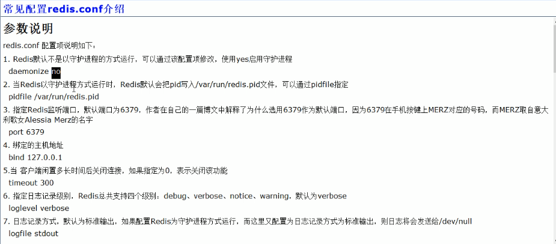
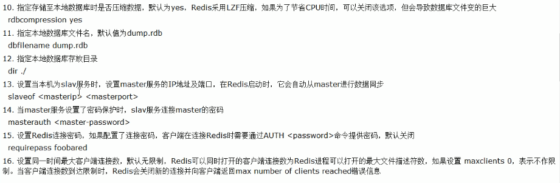
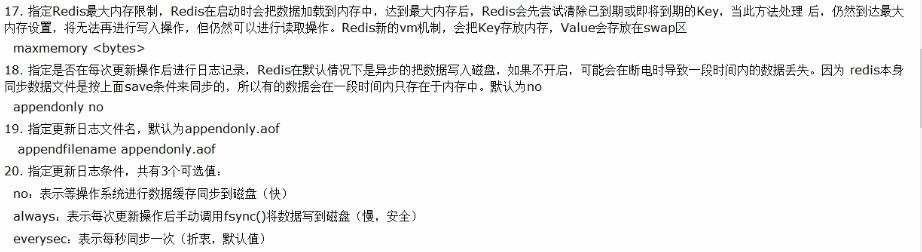
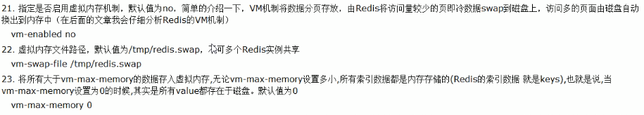
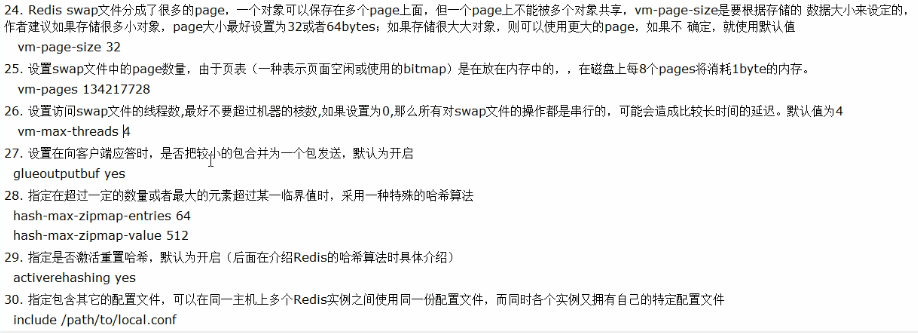
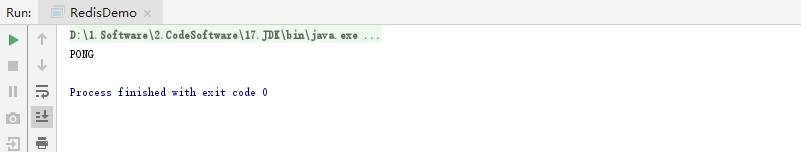
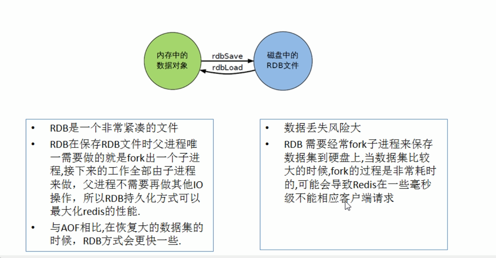
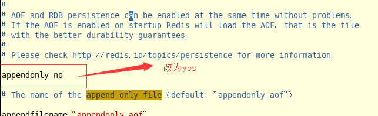
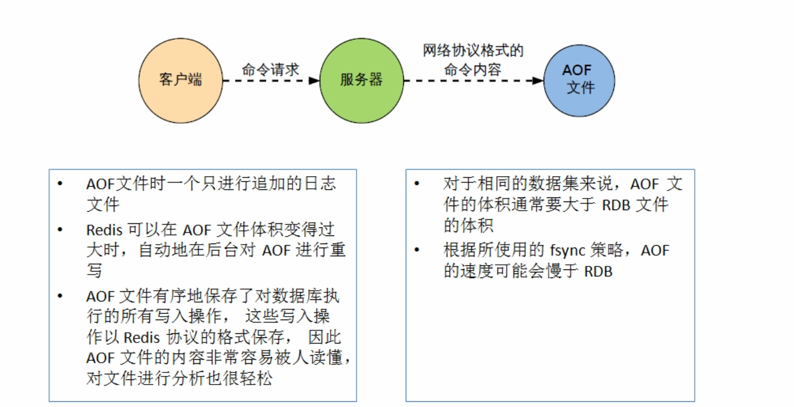

typora-copy-images-to: redis笔记截图

# 0.参考笔记

[有道云笔记]: https://note.youdao.com/ynoteshare1/index.html?id=bfcc478547c920926146675e678e4a1f&amp;type=note

# 1. Redis安装

## 1.1 gcc安装

```cmd
// 需要联网下载
yum -y install gcc automake autoconf libtool make
```

## 1.2  安装Redis

```cmd
// 需要联网下载
wget http://download.redis.io/releases/redis-4.0.1.tar.gz
// 解压
tar zxvf redis-4.0.1.tar.gz
// 进入redis文件夹
cd redis-4.0.1
// 编译
make MALLOC=libc
// 安装到指定文件夹
cd /usr/local/redis
```

# 2. 启动Redis

## 2.1 启动Redis服务

```cmd
// 进入redis安装文件夹
cd /usr/local/redis
// 启动服务端
./bin/redis-server
```


## 2.2 启动客户端

**注意：需要另外开放一个窗口不要把服务端口关闭**

```cmd
// 进入目录执行指令
cd  /usr/local/redis
// 启动客户端
./bin/redis-cli
// 测试是否连接成功
ping
```


# **3. Linux配置Redis以及重启**

## 3.1 复制解压包配置文件到指定目录

```cmd
// 进入redis安装包文件
cd redis-4.0.1
// 把该文件redis.conf 复制到 redis 安装路劲下
cp redis.conf /usr/local/redis

// 验证复制是否成功
cd /usr/local/redis
ll
```

## 3.2 自定义配置Redis

### 3.2.1 进入对应安装目录修改配置文件

```
cd /usr/local/redis
vim redis.conf
```

### 3.2.2 **更改保护线程** 

```
daemonize no  修改为 daemonize yes 
```

### 3.2.3 设置可远程访问

```
bind 127.0.01  注释掉
```

### 3.2.4 设置密码

```
requirepass 设置密码  
```

## 3.3 配置文件详细解释

```cmd
redis.conf 配置项说明如下：
1. Redis默认不是以守护进程的方式运行，可以通过该配置项修改，使用yes启用守护进程
    daemonize no
2. 当Redis以守护进程方式运行时，Redis默认会把pid写入/var/run/redis.pid文件，可以通过pidfile指定
    pidfile /var/run/redis.pid
3. 指定Redis监听端口，默认端口为6379，为什么选用6379作为默认端口，因为6379在手机按键上MERZ对应的号码，而MERZ取自意大利歌女Alessia Merz的名字
    port 6379
4. 绑定的主机地址
    bind 127.0.0.1
5. 当客户端闲置多长时间后关闭连接，如果指定为0，表示关闭该功能
    timeout 300
6. 指定日志记录级别，Redis总共支持四个级别：debug、verbose、notice、warning，默认为verbose
    loglevel verbose
7. 日志记录方式，默认为标准输出，如果配置Redis为守护进程方式运行，而这里又配置为日志记录方式为标准输出，则日志将会发送给/dev/null
    logfile stdout
8. 设置数据库的数量，默认数据库为0，可以使用SELECT <dbid>命令在连接上指定数据库id
    databases 16
9. 指定在多长时间内，有多少次更新操作，就将数据同步到数据文件，可以多个条件配合
    save <seconds> <changes>
    Redis默认配置文件中提供了三个条件：
    save 900 1
    save 300 10
    save 60 10000
    分别表示900秒（15分钟）内有1个更改，300秒（5分钟）内有10个更改以及60秒内有10000个更改。
 
10. 指定存储至本地数据库时是否压缩数据，默认为yes，Redis采用LZF压缩，如果为了节省CPU时间，可以关闭该选项，但会导致数据库文件变的巨大
    rdbcompression yes
11. 指定本地数据库文件名，默认值为dump.rdb
    dbfilename dump.rdb
12. 指定本地数据库存放目录
    dir ./
13. 设置当本机为slav服务时，设置master服务的IP地址及端口，在Redis启动时，它会自动从master进行数据同步
    slaveof <masterip> <masterport>
14. 当master服务设置了密码保护时，slav服务连接master的密码
    masterauth <master-password>
15. 设置Redis连接密码，如果配置了连接密码，客户端在连接Redis时需要通过AUTH <password>命令提供密码，默认关闭
    requirepass foobared
16. 设置同一时间最大客户端连接数，默认无限制，Redis可以同时打开的客户端连接数为Redis进程可以打开的最大文件描述符数，如果设置 maxclients 0，表示不作限制。当客户端连接数到达限制时，Redis会关闭新的连接并向客户端返回max number of clients reached错误信息
    maxclients 128
17. 指定Redis最大内存限制，Redis在启动时会把数据加载到内存中，达到最大内存后，Redis会先尝试清除已到期或即将到期的Key，当此方法处理 后，仍然到达最大内存设置，将无法再进行写入操作，但仍然可以进行读取操作。Redis新的vm机制，会把Key存放内存，Value会存放在swap区
    maxmemory <bytes>
18. 指定是否在每次更新操作后进行日志记录，Redis在默认情况下是异步的把数据写入磁盘，如果不开启，可能会在断电时导致一段时间内的数据丢失。因为 redis本身同步数据文件是按上面save条件来同步的，所以有的数据会在一段时间内只存在于内存中。默认为no
    appendonly no
19. 指定更新日志文件名，默认为appendonly.aof
     appendfilename appendonly.aof
20. 指定更新日志条件，共有3个可选值： 
    no：表示等操作系统进行数据缓存同步到磁盘（快） 
    always：表示每次更新操作后手动调用fsync()将数据写到磁盘（慢，安全） 
    everysec：表示每秒同步一次（折中，默认值）
    appendfsync everysec
 
21. 指定是否启用虚拟内存机制，默认值为no，简单的介绍一下，VM机制将数据分页存放，由Redis将访问量较少的页即冷数据swap到磁盘上，访问多的页面由磁盘自动换出到内存中（在后面的文章我会仔细分析Redis的VM机制）
     vm-enabled no
22. 虚拟内存文件路径，默认值为/tmp/redis.swap，不可多个Redis实例共享
     vm-swap-file /tmp/redis.swap
23. 将所有大于vm-max-memory的数据存入虚拟内存,无论vm-max-memory设置多小,所有索引数据都是内存存储的(Redis的索引数据 就是keys),也就是说,当vm-max-memory设置为0的时候,其实是所有value都存在于磁盘。默认值为0
     vm-max-memory 0
24. Redis swap文件分成了很多的page，一个对象可以保存在多个page上面，但一个page上不能被多个对象共享，vm-page-size是要根据存储的 数据大小来设定的，作者建议如果存储很多小对象，page大小最好设置为32或者64bytes；如果存储很大大对象，则可以使用更大的page，如果不 确定，就使用默认值
     vm-page-size 32
25. 设置swap文件中的page数量，由于页表（一种表示页面空闲或使用的bitmap）是在放在内存中的，，在磁盘上每8个pages将消耗1byte的内存。
     vm-pages 134217728
26. 设置访问swap文件的线程数,最好不要超过机器的核数,如果设置为0,那么所有对swap文件的操作都是串行的，可能会造成比较长时间的延迟。默认值为4
     vm-max-threads 4
27. 设置在向客户端应答时，是否把较小的包合并为一个包发送，默认为开启
    glueoutputbuf yes
28. 指定在超过一定的数量或者最大的元素超过某一临界值时，采用一种特殊的哈希算法
    hash-max-zipmap-entries 64
    hash-max-zipmap-value 512
29. 指定是否激活重置哈希，默认为开启（后面在介绍Redis的哈希算法时具体介绍）
    activerehashing yes
30. 指定包含其它的配置文件，可以在同一主机上多个Redis实例之间使用同一份配置文件，而同时各个实例又拥有自己的特定配置文件
    include /path/to/local.conf

31.Redis中的内存维护策略   Maxmemory-policy

redis作为优秀的中间缓存件，时常会存储大量的数据，即使采取了集群部署来动态扩容，也应该即使的整理内存，维持系统性能。

在redis中有两种解决方案，
一是为数据设置超时时间，

二是采用LRU算法动态将不用的数据删除。内存管理的一种页面置换算法，对于在内存中但又不用的数据块（内存块）叫做LRU，操作系统会根据哪些数据属于LRU而将其移出内存而腾出空间来加载另外的数据。

1.volatile-lru：设定超时时间的数据中,删除最不常使用的数据.

2.allkeys-lru：查询所有的key中最近最不常使用的数据进行删除，这是应用最广泛的策略.

3.volatile-random：在已经设定了超时的数据中随机删除.

4.allkeys-random：查询所有的key,之后随机删除.

5.volatile-ttl：查询全部设定超时时间的数据,之后排序,将马上将要过期的数据进行删除操作.

6.noeviction：如果设置为该属性,则不会进行删除操作,如果内存溢出则报错返回.
volatile-lfu：从所有配置了过期时间的键中驱逐使用频率最少的键
allkeys-lfu：从所有键中驱逐使用频率最少的键
https://www.jianshu.com/p/c8aeb3eee6bc
```












## 3.4 更改配置后重新启动

```cmd
执行以下命令前提：cd /usr/local/redis

服务端启动：
./bin/redis-server ./redis.conf

客户端启动：
本地客户端登录
用redis-cli 密码登陆（redis-cli -a  password） 

// 远程登陆语法   默认 ip：127.0.0.1 端口：6379
redis-cli -h host -p port -a password
redis-cli –h IP地址 –p 端口 –a 密码
```

## 3.5 Redis关闭

### 3.5.1 非正常关闭容易数据丢失

```cmd
// 查询PID
ps -ef | grep -i redis
// 杀死进程
kill -9 PID
```

### 3.5.2 正常关闭、数据保存

```cmd
// 关闭redis，通过客户端shutdown
./bin/redis-cli shutdown
```

## 4. Redis常用命令

### 4.1 基本命令

```javascript
// 查看所有 key
keys *
    
// 删除某个 key
del key

// 判断某个 key 是否存在
exists key

// 序列化 key
dump key

// 查看剩余时间
ttl a           //返回值为 -1 即代表永久 -2 表示无效

// 设置有效时间
expire b 10     // 只有 10 秒时间

// 设置永久有效
persist a

// 通配符
* :表示任意   ？：表示单个字符

// 重命名 key
rename a user:4

// 移动 key 到 给定数据库
move a 1         // 移动到数据库 1

// 切换数据库
select 1

// 查看key 类型
type key

// 清空缓存所有数据
flushall
```

### 4.2 String命令

```javascript
// 不存在赋值，存在取消此次操作
setnx gradeName 1
msetnx gradeName 1 k1 v1       //注意只要一个存在全部操作取消

// 字符截取  下标从0开始
getrange grade start end  

// 取出旧值存入新值 若不存在键返回nil
getset a 123

// 获取长度
strlen key

// 删除命令
del key

// key值自增1 若是未有值则设为0再加1
incr topic:num
incrby topic:num 10 // 设定自加10

// key值自减1
decr topic:num
decrby topic:num 10 // 设定自减10

// 设置存活时间  key time content
setex k4 10 v4

// 设置多个值
mset k1 v1 k2 v2 k3 v3

// 取多个值
mget k1 k2 k3
```

### 4.3 Hash命令

**Hash数据类型类似于java中的对象**

```javascript
// 赋值hash单个属性
hset user:1 name zhangsan 

// 赋值整个hash数据类型多个属性
hmset user:1 name zhangsan age 15 

// 获取单个hash数据
hget user：1 name

// 获取多个hash数据
hmget user:1 name age

// 获取所有hash数据
hgetall user:1

// 查询所有hash的key值
hkeys user:1

// 获取hash表中字段数量
hlen user:1

// 删除hash一个或多个字段
hdel user:1 age

// 不存在某值执行操作，存在不执行
hsetnx key name asdf

// 自加x操作 对hash中String类型无效
hincrby user:1 age x

// 判断字段是否存在
hexists users:1 age

// 获取所有的key
hkeys user:1

// 获取所有的值
hvals user:1
```

### 4.4 List命令

```javascript
// 新增list 
    // 正进反出 类似栈
    Lpush list 0 1 2 3 4
    // 正进正出 类似队列
    Rpush list 0 1 2 3 4

// 取值 范围
Lrange list 0 -1  //全取

// 删除
	// 删除第一个
    Lpop list 
    // 删除最后一个
    Rpop list 
// 获取指定位的值 下表从零开始
    Lindex list 1

// 获取长度
Llen list 

// 删除n个值  删掉 2 个 3
lrem list 2 3

// 截取部分list 返回赋值 list
Ltrim list 3 5

// 在list 替换某值
lset list 1 10

// list 插入某值
	// 向 x:代表具体值 不是索引  前插入某值
	linsert l1 before x 10
	// 向后插入某值
    linsert l1 after x 10
```

### 5.5 set命令

```javascript
// 添加值
SADD runoobkey redis 123

// 判断存在某值
SISmember value

// 获取所有值
smembers key

// 获取集合的成员数
SCARD key 

// 删除基本 1个至多个成员 随机删除
spop set1 3
spop set1 
 
// 移动某个set值到另外一个 5 代表具体值
smove set01 set02 5

// 返回给定所有集合的差集
SDIFF key1 [key2] 

// 随机集合成员数
srandmember set1 1

// 返回给定所有集合的差集并存储在 destination 中
SDIFFSTORE destination key1 [key2] 

// 返回给定所有集合的交集
SINTER key1 [key2] 

// 返回给定所有集合的交集并存储在 destination 中
SINTERSTORE destination key1 [key2] 

// 判断 member 元素是否是集合 key 的成员
SISMEMBER key member 

// 返回集合中的所有成员
SMEMBERS key 

// 将 member 元素从 source 集合移动到 destination 集合
SMOVE source destination member 

// 移除并返回集合中的一个随机元素
SPOP key 

// 返回集合中一个或多个随机数
SRANDMEMBER key [count] 

//移除集合中一个或多个成员
SREM key member1 [member2] 

// 返回所有给定集合的并集
SUNION key1 [key2] 

// 所有给定集合的并集存储在 destination 集合中
SUNIONSTORE destination key1 [key2] 

// 迭代集合中的元素
SSCAN key cursor [MATCH pattern] [COUNT count] 
```

### 5.6 ZSet命令

```javascript
// 添加元素
zadd zset1 60 v1 70 v2

// 获取元素
zrange zset1 0 -1
zrange zset1 0 -1 withscores  // 带上分值

// 通过分值范围获取 value  limit index size
zrangebyscore zset1 60 90
zrangebyscore zset1 60 90 limit 2 2
 
// 移除某个值 v5 为 value
zrem zset1 v5 

// 计算个数
zcard zset1s

// 查看下标 即排名
zrank zset1 v4
 
// 获取score值
zsocre zset1 v4

// 根据score统计数量 
zcount zset1 60 90


// 逆序获取下标
zrevrank zset1 v4

// 反转通过score 获取 zset值
zReRangeByScore zset1 90 60
```

## 5.  Java联系Redis

### 5.1  打开Redis服务

```
cd /usr/local/redis
./bin/redis-server ./redis.conf
```

### 5.2  java项目中安装依赖

```xml-dtd
 <!-- 连接redis安装包-->
        <dependency>
            <groupId>redis.clients</groupId>
            <artifactId>jedis</artifactId>
            <version>2.9.0</version>
        </dependency>
```

### 5.3 java测试连接代码

```java
        String host = "192.168.174.128";
        Jedis jedis = new Jedis(host, 6379);
        jedis.auth("123456");
        System.out.println(jedis.ping());
```

### 5.4  查看Linux端口

**由于Linux默认不向外开放端口因此会出现报错现象，需要执行向外开发端口命令**

```javascript
// 查看端口 支持centos7 以上
firewall-cmd --list-ports
// 查看端口 centos6.x
netstat -nap
// 开放端口 root用户登陆，输入如下命令开启端口
/sbin/iptables -I INPUT -p tcp --dport 6379 -j ACCEPT
// 刷新自动启动保存
/etc/rc.d/init.d/iptables save
```

**连接成功效果**



## 6. Redis工具类

```java
import redis.clients.jedis.Jedis;
import redis.clients.jedis.JedisPool;
import redis.clients.jedis.JedisPoolConfig;

public  class RedisUtil {
    private static JedisPool pool;
    static {
        // 1. 连接池配置信息
        JedisPoolConfig jedisPoolConfig = new JedisPoolConfig();
        // 最大连接数
        jedisPoolConfig.setMaxTotal(5);
        // 最大空闲数
        jedisPoolConfig.setMaxIdle(1);
        // 。。。。。。其他配置
        // 2. 连接
        String host = "192.168.174.128";
        int port = 6379;
        pool = new JedisPool(jedisPoolConfig, host, port);
    }

    public static Jedis getResource() {
        return pool.getResource();
    }

    public static void colse (Jedis jedis) {
        jedis.close();
    }
}

```

## 7. Jedis-hash类型获取(案例)

```java
	@Test
	public void getUser() {
		String key = "User:1";
		Jedis jedis = RedisUtil.getResource();

		if (jedis.exists(key)) {
			Map<String, String> hash = jedis.hgetAll(key);
			User u = new User();
			u.setUserName(hash.get("name")).setAge(Integer.parseInt(hash.get("age"))).setAdress("adress");
			System.out.println("从Redis中获取数据：" + u.toString());
		} else {
			// 模拟从mysql获取数据
			Map<String, String> map = new HashMap<>();
			map.put("name", "zhangSan");
			map.put("age", "14");
			map.put("adress", "地址");
			jedis.hmset(key, map);
			System.out.println("从MySQl获取数据存放到Redis + " + map.toString());
		}
		RedisUtil.colse(jedis);
	}
```

## 8. Redis持久化

### 8.1 RDB(redis database)



### 8.2 AOF(append only file)

### 8.2.0 原理

​    **aof原理实际上是保存每一次客户端对数据库操作的指令，当恢复时候重新执行指令，达到恢复效果**

### 8.2.1 开启Aof

**配置文件redis.conf**



### 8.2.2  出现故障回复AOF

```
redis-check-aof --fix appendonly.aof
```

### 8.2.3 总结



