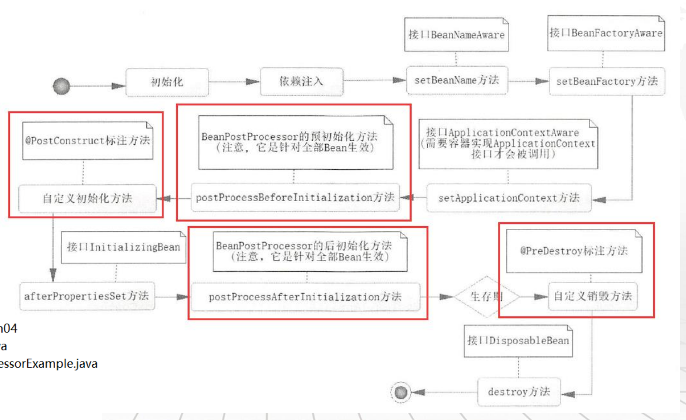

# 1.概念知识

## 1.1Bean生命周期

**具体代码：learningspring.ch04**



### 1.1.1实现对生命周期操作，除红框部分，直接继承接口

```java
/**
 * Beans生命周期，实际开发中最常用是自定义方法配合@PostConstruct和@PreDestroy
 *
 * @author tangwei
 */
@Repository
public class UserDao
		implements BeanNameAware, BeanFactoryAware, ApplicationContextAware, InitializingBean, DisposableBean {

	// 默认按类型
	@Autowired
	private User user;

	public void insertUser() {
		System.out.println("新增一个用户：" + user);
	}

	@Override
	public void setBeanName(String name) {
		System.out.println("【" + this.getClass().getSimpleName() + "】调用BeanNameAware的setBeanName");
	}

	@Override
	public void setBeanFactory(BeanFactory beanFactory) throws BeansException {
		System.out.println("【" + this.getClass().getSimpleName() + "】调用BeanFactoryAware的setBeanFactory");
	}

	@Override
	public void setApplicationContext(ApplicationContext applicationContext) throws BeansException {
		System.out.println("【" + this.getClass().getSimpleName() + "】调用ApplicationContextAware的setApplicationContext");
	}

	@Override
	public void afterPropertiesSet() throws Exception {
		System.out.println("【" + this.getClass().getSimpleName() + "】调用InitializingBean的afterPropertiesSet方法");
	}

	@Override
	public void destroy() throws Exception {
		System.out.println("【" + this.getClass().getSimpleName() + "】 DisposableBean方法");
	}
	
	/**
	 * @PostConstruct
	 * 	自定义方法，Bean初始化时运行
	 */
	//@PostConstruct
	public void init() {
		System.out.println("【" + this.getClass().getSimpleName() + "】注解@PostConstruct定义的自定义初始化方法");
	}
	
	/**
	 * @PreDestroy
	 * 	自定义方法，Bean销毁时运行
	 */
	//@PreDestroy
	public void destroy1() {
		System.out.println("【" + this.getClass().getSimpleName() + "】注解@PreDestroy定义的自定义销毁方法");
	}
}
```

### 1.1.2 实现全部Bean周期的方法:例图中间两个红框

```java
/**
 * Bean后置处理器将对所有的Bean有效
 *
 * @author tangwei
 */
@Component
public class BeanPostProcessorExample implements BeanPostProcessor {

    // 该方法在 init 方法之前被调用
    @Override
    public Object postProcessBeforeInitialization(Object bean, String beanName) throws BeansException {
        System.out.println("BeanPostProcessor调用postProcessBeforeInitialization方法，参数【" + bean.getClass().getSimpleName()
            + "】【" + beanName + "】 ");
        // 如返回null，bean就从IoC容器中销毁
        return bean;

        /*// 由于BeanPostProcessor对所有的Bean有效，因此实际开发应做条件过滤处理
        if (bean instanceof UserDao) {
        	System.out.println("BeanPostProcessor调用postProcessBeforeInitialization方法，参数【" 
        	        + bean.getClass().getSimpleName()+ "】【" +beanName+"】 ");
        	return bean;
        }else {
        	return bean;
        }*/
    }

    // 该方法在 init 方法之后被调用
    @Override
    public Object postProcessAfterInitialization(Object bean, String beanName) throws BeansException {
        System.out.println("BeanPostProcessor调用postProcessAfterInitialization方法，参数【" + bean.getClass().getSimpleName()
            + "】【" + beanName + "】 ");
        // 如返回null，bean就从IoC容器中销毁
        return bean;

        /*// 由于BeanPostProcessor对所有的Bean有效，因此实际开发应做条件过滤处理
        if (beanName.equals("userDao")) {
        	System.out.println("BeanPostProcessor调用postProcessAfterInitialization方法，参数【" 
        	        + bean.getClass().getSimpleName()+ "】【" +beanName+"】 ");
        	return bean;
        }else {
        	return bean;
        }*/
    }

}
```

### 	1.1.3使用自定义方法调用初始化和销毁(常用)

**说明：其中init与destroy是User类内部方法**

```java
@Configuration
@ComponentScan()
public class AppConfig {
	
	/**
	 * @Bean
	 * 	引用第三方jar，Bean注入是使用initMethod和destroyMethod，执行初始化和销毁操作
	 * 	如：数据源的配置
	 * 
	 * @return
	 */
	@Bean(name = "user3"
			,initMethod="init", destroyMethod="destroy"
			)
	public User createUser3() {
		User user = new User();
		user.setId(3L);
		user.setUserName("user_name_3");
		user.setNote("note_3");
		return user;
	}
}
```

