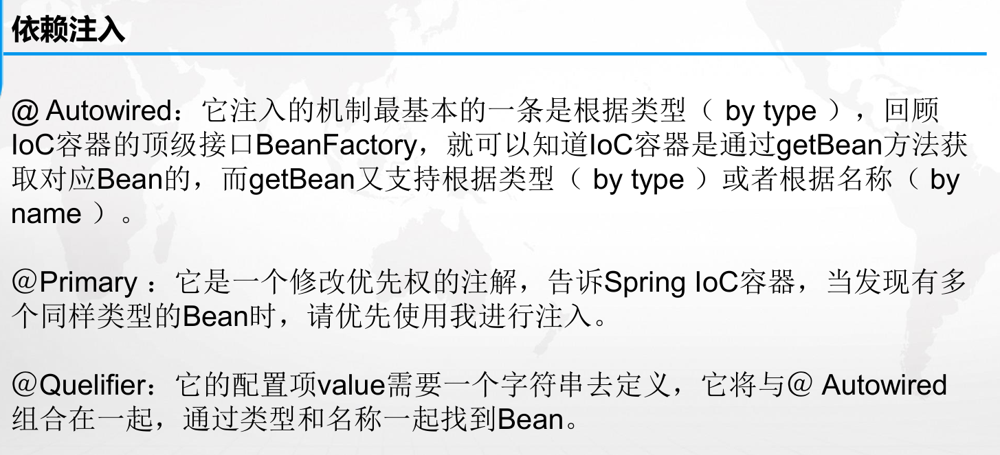

## 1.依赖注入方式

**具体代码：learningspring.ch02**



### 注入指定实体类

```java
    // 默认按类型
    @Autowired
    // 按名称
    @Qualifier(value = "user3")
    private User user;
```


## 2.Spring 异步与计划任务

**具体代码：learningspring.ch08**

