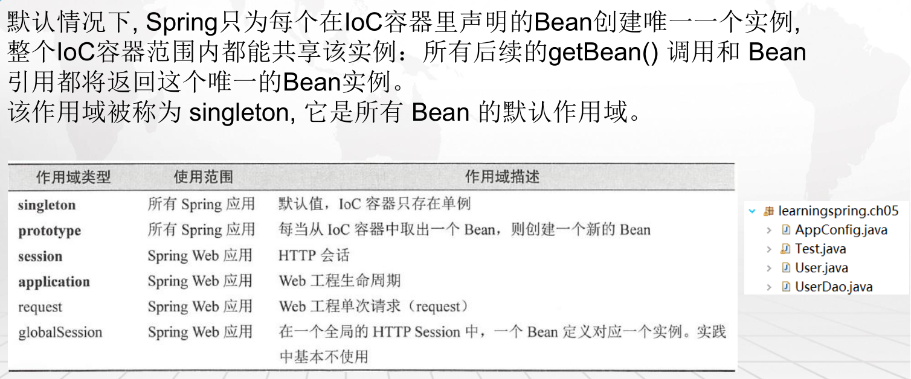

# 1.过滤文件运用

**具体代码：learningspring.ch02**

```java
/**
 * @Configuration 
 * 	代表这是一个Java配置文件， Spring的容器会根据它来生成IoC容器去装配Bean
 * 
 * @ComponentScan 
 * 	意味着它会进行扫描，但是它只会扫描类AppConfig所在的当前包和其子包
 *	可以通过basePackageClasses定义扫描的类
 *	其中还有includeFiltershe和excludeFilters
 *		includeFilters是定义满足过滤器（ Filter ）条件的Bean才去扫描
 *		excludeFilters则是排除过滤器条件的Bean，它们都需要通过一个注解＠Filter去定义，
 *		它有一个type类型，这里可以定义为注解或者正则式等类型。classes定义注解类，pattern定义正则式类。
 * 
 * @author tangwei
 */
@Configuration
@ComponentScan()
//@ComponentScan(basePackageClasses = { User.class })
//@ComponentScan("learningspring.*")
//@ComponentScan(basePackages = { "learningspring.ch2" }, excludeFilters = { @Filter(classes = { Service.class }) })
```

# 2.Bean作用域(singleton)

**具体代码：learningspring.ch05**



**关键代码**

```java
@Scope(ConfigurableBeanFactory.SCOPE_PROTOTYPE)
```

# 3.读取配置文件

**读取properties文件到java类**

**具体代码：learningspring.ch06**

**说明：默认读取的配置文件路径是在src/mian/resources**

```java
/**
 * @Component:
 * 	表明这个类将被Spring IoC容器扫描装配,其中配置的"user"则是作为Bean的名
 * 	不配置这个字符串，那么IoC容器就会把类名第一个字母作为小写，其他不变作为Bean名称放入到IoC容器中
 * 
 * @PropertySource
 * 	配置文件的路径
 * 
 * @PropertySources()
 * 	配置多个文件
 * 
 * @author tangwei
 */
@Component("user100")
@PropertySource("user.properties")
//@PropertySources()
public class User {
	
	/**
	 * @Value:
	 * 	是指定具体的值，使得Spring IoC给予对应的属性注入对应的值
	 */
	@Value("${user.id}")
	private Long id;
	@Value("${user.userName}")
	private String userName;
	@Value("${user.note}")
	private String note;
// 忽略set/get方法
}
```

# 4.Condition注解

**具体代码：learningspring.ch07**

**说明：实现满足条件就产生javabean看业务需求只要实现一个接口Condition**


**Condition类**

```java
/**
 * User类的自定义Condition Springboot内置了许多condition(org.springframework.boot.autoconfigure.condition) 实战开发中，可以直接使用，无需再定义去开发
 * 
 * @author tangwei
 */
public class UserCondition implements Condition {

    /**
     * User装配的条件 context：条件上下文 metadata：注释类型的元数据
     * 
     */
    @Override
    public boolean matches(ConditionContext context, AnnotatedTypeMetadata metadata) {
        // 业务逻辑判断...
        return true;
    }

}
```


**约束javaBean生成条件**

```java
@Configuration
@ComponentScan()
public class AppConfig {
    /**
     * @Conditional 基于条件的自动配置，自定义的UserCondition类，matches返回true才装配
     * @return
     */
    @Bean("user300")
    @Conditional(UserCondition.class)
    public User createUser300() {
        User user = new User();
        user.setId(300L);
        user.setUserName("user_name_300");
        user.setNote("note_300");
        return user;
    }
}
```

