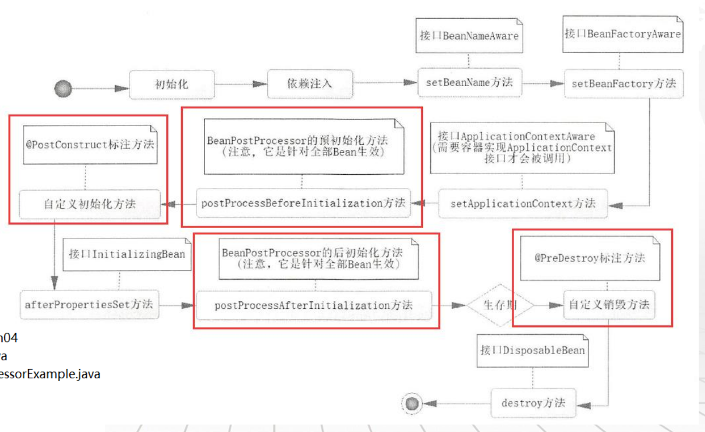
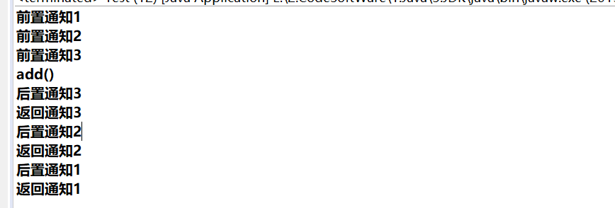

# 1.Bean生命周期

**具体代码：learningspring.ch04**



1.1实现对生命周期操作，除红框部分，直接继承接口

```java
/**
 * Beans生命周期，实际开发中最常用是自定义方法配合@PostConstruct和@PreDestroy
 *
 * @author tangwei
 */
@Repository
public class UserDao
		implements BeanNameAware, BeanFactoryAware, ApplicationContextAware, InitializingBean, DisposableBean {

	// 默认按类型
	@Autowired
	private User user;

	public void insertUser() {
		System.out.println("新增一个用户：" + user);
	}

	@Override
	public void setBeanName(String name) {
		System.out.println("【" + this.getClass().getSimpleName() + "】调用BeanNameAware的setBeanName");
	}

	@Override
	public void setBeanFactory(BeanFactory beanFactory) throws BeansException {
		System.out.println("【" + this.getClass().getSimpleName() + "】调用BeanFactoryAware的setBeanFactory");
	}

	@Override
	public void setApplicationContext(ApplicationContext applicationContext) throws BeansException {
		System.out.println("【" + this.getClass().getSimpleName() + "】调用ApplicationContextAware的setApplicationContext");
	}

	@Override
	public void afterPropertiesSet() throws Exception {
		System.out.println("【" + this.getClass().getSimpleName() + "】调用InitializingBean的afterPropertiesSet方法");
	}

	@Override
	public void destroy() throws Exception {
		System.out.println("【" + this.getClass().getSimpleName() + "】 DisposableBean方法");
	}
	
	/**
	 * @PostConstruct
	 * 	自定义方法，Bean初始化时运行
	 */
	//@PostConstruct
	public void init() {
		System.out.println("【" + this.getClass().getSimpleName() + "】注解@PostConstruct定义的自定义初始化方法");
	}
	
	/**
	 * @PreDestroy
	 * 	自定义方法，Bean销毁时运行
	 */
	//@PreDestroy
	public void destroy1() {
		System.out.println("【" + this.getClass().getSimpleName() + "】注解@PreDestroy定义的自定义销毁方法");
	}
}
```

1.2 实现全部Bean周期的方法:例图中间两个红框

```java
/**
 * Bean后置处理器将对所有的Bean有效
 *
 * @author tangwei
 */
@Component
public class BeanPostProcessorExample implements BeanPostProcessor {

    // 该方法在 init 方法之前被调用
    @Override
    public Object postProcessBeforeInitialization(Object bean, String beanName) throws BeansException {
        System.out.println("BeanPostProcessor调用postProcessBeforeInitialization方法，参数【" + bean.getClass().getSimpleName()
            + "】【" + beanName + "】 ");
        // 如返回null，bean就从IoC容器中销毁
        return bean;

        /*// 由于BeanPostProcessor对所有的Bean有效，因此实际开发应做条件过滤处理
        if (bean instanceof UserDao) {
        	System.out.println("BeanPostProcessor调用postProcessBeforeInitialization方法，参数【" 
        	        + bean.getClass().getSimpleName()+ "】【" +beanName+"】 ");
        	return bean;
        }else {
        	return bean;
        }*/
    }

    // 该方法在 init 方法之后被调用
    @Override
    public Object postProcessAfterInitialization(Object bean, String beanName) throws BeansException {
        System.out.println("BeanPostProcessor调用postProcessAfterInitialization方法，参数【" + bean.getClass().getSimpleName()
            + "】【" + beanName + "】 ");
        // 如返回null，bean就从IoC容器中销毁
        return bean;

        /*// 由于BeanPostProcessor对所有的Bean有效，因此实际开发应做条件过滤处理
        if (beanName.equals("userDao")) {
        	System.out.println("BeanPostProcessor调用postProcessAfterInitialization方法，参数【" 
        	        + bean.getClass().getSimpleName()+ "】【" +beanName+"】 ");
        	return bean;
        }else {
        	return bean;
        }*/
    }

}
```

## 	1.3使用自定义方法调用初始化和销毁(常用)

**说明：其中init与destroy是User类内部方法**

```java
@Configuration
@ComponentScan()
public class AppConfig {
	
	/**
	 * @Bean
	 * 	引用第三方jar，Bean注入是使用initMethod和destroyMethod，执行初始化和销毁操作
	 * 	如：数据源的配置
	 * 
	 * @return
	 */
	@Bean(name = "user3"
			,initMethod="init", destroyMethod="destroy"
			)
	public User createUser3() {
		User user = new User();
		user.setId(3L);
		user.setUserName("user_name_3");
		user.setNote("note_3");
		return user;
	}
}
```


# 2. Spring Aop 思想

## 2.1 传统实现动态代理(reflect实现)

**具体代码：learningspring.ch11 : ps 还有静态代理**

```java
public class ArithmeticCalculatorLoggingProxy {
	
	//要代理的对象
	private ArithmeticCalculator target;
	
	public ArithmeticCalculatorLoggingProxy(ArithmeticCalculator target) {
		super();
		this.target = target;
	}

	//返回代理对象
	public ArithmeticCalculator getLoggingProxy(){
		ArithmeticCalculator proxy = null;
		
		ClassLoader loader = target.getClass().getClassLoader();
		Class [] interfaces = new Class[]{ArithmeticCalculator.class};
		InvocationHandler h = new InvocationHandler() {
			/**
			 * proxy: 代理对象。 一般不使用该对象
			 * method: 正在被调用的方法
			 * args: 调用方法传入的参数
			 */
			@Override
			public Object invoke(Object proxy, Method method, Object[] args)
					throws Throwable {
				String methodName = method.getName();
				//打印日志
				System.out.println("[before] The method " + methodName + " begins with " + Arrays.asList(args));
				
				//调用目标方法
				Object result = null;
				
				try {
					//前置通知
					result = method.invoke(target, args);
					//返回通知, 可以访问到方法的返回值
				} catch (NullPointerException e) {
					e.printStackTrace();
					//异常通知, 可以访问到方法出现的异常
				}
				
				//后置通知. 因为方法可以能会出异常, 所以访问不到方法的返回值
				
				//打印日志
				System.out.println("[after] The method ends with " + result);
				
				return result;
			}
		};
		
		/**
		 * loader: 代理对象使用的类加载器。 
		 * interfaces: 指定代理对象的类型. 即代理代理对象中可以有哪些方法. 
		 * h: 当具体调用代理对象的方法时, 应该如何进行响应, 实际上就是调用 InvocationHandler 的 invoke 方法
		 */
		proxy = (ArithmeticCalculator) Proxy.newProxyInstance(loader, interfaces, h);
		
		return proxy;
	}
}
```


## 2.2 Spring实现方式

**具体代码：learningspring.ch12**


**开启功能**

```java
@Configuration
@ComponentScan()
@EnableAspectJAutoProxy
public class AppConfig {
	
}
```


**切点类**

```java
@Component
public class DaoImpl implements IDao {

	@Override
	public void add() {
		System.out.println("add()");
	}

	@Override
	public String add(String name){
		System.out.println("有String参数的add()");
		return name;
	}
}

```


**切面类**

```java
/**
 * @Aspect
 * 	标识这个类是一个切面
 *
 * @author tangwei
 */
@Component
@Aspect
public class MyAspect {

	/**
	 * execution(* learningspring.ch12..*.*(..))
	 * 第一个* 表示任意的返回方法
	 * learningspring.ch12  表示包名
	 * .. 表示对子包也拦截
	 * 第二个* 表示所有类
	 * 第三个* 表示所有方法
	 * 挂号中的.. 表示任意的参数，可以有一个，多个，无
	 * 
	 * execution(java.lang.String learningspring.ch12.Daoimpl(java.lang.Integer,..)
	 * execution(!void learningspring.ch12.Daoimpl(java.lang.Integer,..)
	 */
	
	/**
	 * @Pointcu
	 * 	声明一个切入点
	 */
	@Pointcut("execution(* learningspring.ch12.IDao.*(..))")
	public void anyMethod() {}
	
	/**
	 * @Before
	 * 	前置通知：在方法执行之前执行的通知
	 */
	@Before(value = "execution(public void learningspring.ch12.DaoImpl.add())")
	//@Before("anyMethod()")
	public void before() {
		System.out.println("前置通知@Before");
	}
		
	/**
	 * @Before
	 * 	前置通知：在方法执行之前执行的通知
	 * 	args(name)表示只织入 有一个String参数的方法，就不是所有方法都织入了
	 */
	@Before("anyMethod() && args(name)")
  	public void before(JoinPoint point,String name) {
		// JoinPoint：可获取参数
		/*Object[] objs = point.getArgs();
		for (Object obj : objs) {
			System.out.println(obj);
		}*/
		System.out.println("前置通知@Before，输入参数：" + name);
	}
	
	/**
	 * @After
	 * 	后置通知：在连接点完成之后执行的,即连接点返回结果或者抛出异常的时候,下面的后置通知记录了方法的终止
	 * 	无论连接点是正常返回还是抛出异常，后置通知都会执行。如果只想在连接点返回的时候记录日志，应使用返回通知代替后置通知
	 */
	@After("anyMethod()")  
	public void after() {
		System.out.println("后置通知@After");
	}
	
	/**
	 * @AfterReturning
	 * 	返回通知：在方法返回结果之后执行
	 */
	@AfterReturning(value = "execution(public void learningspring.ch12.DaoImpl.add())")
	//@AfterReturning("anyMethod()")
	public void afterReturning() {
		System.out.println("返回通知@AfterReturning");
	}
	
	/**
	 * @AfterReturning
	 * 	返回通知：在方法返回结果之后执行
	 * 
	 * @param result
	 */
	@AfterReturning(pointcut = "anyMethod()", returning = "result")
	public void afterReturning(String result) {
		System.out.println("返回通知@AfterReturning，返回结果：" + result);
	}
	
	/**
	 * @AfterThrowing
	 * 	异常通知：只在连接点抛出异常时才执行异常通知
	 * 
	 * @param e
	 */
	@AfterThrowing(pointcut = "anyMethod()", throwing = "e") 
	public void afterThrowing(Exception e) {
		System.out.println("异常通知");
	}
	
	/**
	 * @Around
	 * 	环绕通知 :围绕着方法执行，是所有通知中最为强大的通知，强大也意味着难以控制。
	 * 	一般而言，使用它的场景是在你需要大幅度修改原有目标对象的服务逻辑时，否则都尽量使用其他的通知。
	 * 	环绕通知是一个取代原有目标对象方法的通知，当然它也提供了回调原有目标对象方法的能力。
	 * 
	 * @param pjp
	 * @return
	 * @throws Throwable
	 */
	@Around("anyMethod()")     
	public Object doBasicProfiling(ProceedingJoinPoint pjp) throws Throwable {
		Object result = null;
		//if()   判断权限
		System.out.println("环绕通知前的方法");
		result = pjp.proceed();
		System.out.println("环绕通知后的方法");
		return result;
	}
	
}
```


## 2.3 切面优先级

**具体代码：learningspring.ch13**

**说明：@Order(1)：指定切面的优先级，数值越小，优先级越高**


**添加切面类优先级别方式**

```java
@Component
@Aspect
// 切面优先级别
@Order(1)
public class MyAspect1 {
	// 。。。省略切面类方式
}
```


**分别是切面优先级别123展示执行结果**



