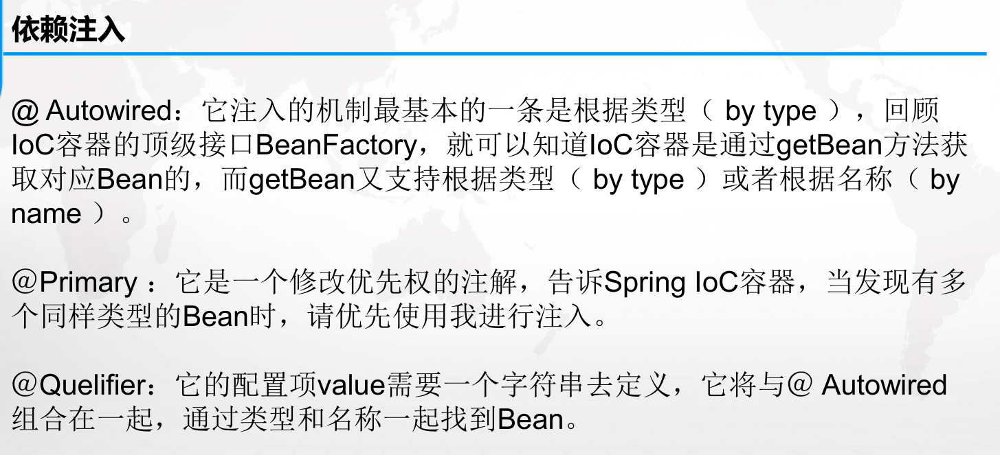

## 1.依赖注入方式

**具体代码：learningspring.ch02**



### 注入指定实体类

```java
    // 默认按类型
    @Autowired
    // 按名称
    @Qualifier(value = "user3")
    private User user;
```


## 2.Spring 异步与计划任务

**具体代码：learningspring.ch08**

### 2.1配置java类打开异步和计划任务功能

```java
@Configuration
@ComponentScan()
@EnableAsync
@EnableScheduling
public class AppConfig {

}
```

### 2.2 使用类实现异步

```java
@Component
public class AsyncTask {

	@Async
	public void task1() {
		try {
			for (int i = 1; i <= 3; i++) {
				System.out.println("======" + i);
				TimeUnit.SECONDS.sleep(1);
			}
		} catch (InterruptedException e) {
			e.printStackTrace();
		}
	}
}
```

### 2.3类实现计划任务

**方式一：**

```java
@Component
public class SchedulerTask1 {

    private int count = 0;

    @Scheduled(cron = "*/1 * * * * ?")
    private void process() {
        System.out.println("this is scheduler task runing  " + (count++));
    }
}
```

**方式二：**

```java
@Component
public class SchedulerTask2 {

    private static final SimpleDateFormat dateFormat = new SimpleDateFormat("HH:mm:ss");

    /**
     * fixedRate:
     * 
     * @Scheduled(fixedRate = 6000) ：上一次开始执行时间点之后6秒再执行
     * @Scheduled(fixedDelay = 6000) ：上一次执行完毕时间点之后6秒再执行
     * @Scheduled(initialDelay=1000, fixedRate=6000) ：第一次延迟1秒后执行，之后按fixedRate的规则每6秒执行一次
     */
    @Scheduled(fixedRate = 6000)
    public void reportCurrentTime() {
        System.out.println("现在时间：" + dateFormat.format(new Date()));
    }
}
```


## 3.不动源代码，添加类方法

**具体代码：learningspring.ch14**


**定义新方法的实现类**

```java
public class DaoValidatorImpl implements DaoValidator {

	@Override
	public boolean validate() {
		System.out.println("引入新的接口："+ DaoValidator.class.getSimpleName());
		return true;
	}

}
```


**新方法实现类织入到老(源)代码内**

**说明：learningspring.ch14.DaoImpl 为老(源)代码  ，  DaoValidatorImpl.class 新代码 **