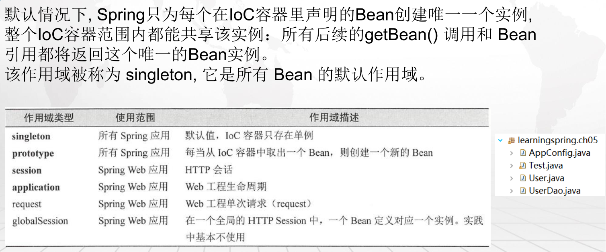

# 1.过滤文件运用

**具体代码：learningspring.ch02**

```java
/**
 * @Configuration 
 * 	代表这是一个Java配置文件， Spring的容器会根据它来生成IoC容器去装配Bean
 * 
 * @ComponentScan 
 * 	意味着它会进行扫描，但是它只会扫描类AppConfig所在的当前包和其子包
 *	可以通过basePackageClasses定义扫描的类
 *	其中还有includeFiltershe和excludeFilters
 *		includeFilters是定义满足过滤器（ Filter ）条件的Bean才去扫描
 *		excludeFilters则是排除过滤器条件的Bean，它们都需要通过一个注解＠Filter去定义，
 *		它有一个type类型，这里可以定义为注解或者正则式等类型。classes定义注解类，pattern定义正则式类。
 * 
 * @author tangwei
 */
@Configuration
@ComponentScan()
//@ComponentScan(basePackageClasses = { User.class })
//@ComponentScan("learningspring.*")
//@ComponentScan(basePackages = { "learningspring.ch2" }, excludeFilters = { @Filter(classes = { Service.class }) })
```

# 2.Bean作用域(singleton)

**具体代码：learningspring.ch05**



**关键代码**

```java
@Scope(ConfigurableBeanFactory.SCOPE_PROTOTYPE)
```

# 3.读取配置文件

## 3.1 读取properties文件到java类

**具体代码：learningspring.ch06**

**说明：默认读取的配置文件路径是在src/mian/resources**

```java
/**
 * @Component:
 * 	表明这个类将被Spring IoC容器扫描装配,其中配置的"user"则是作为Bean的名
 * 	不配置这个字符串，那么IoC容器就会把类名第一个字母作为小写，其他不变作为Bean名称放入到IoC容器中
 * 
 * @PropertySource
 * 	配置文件的路径
 * 
 * @PropertySources()
 * 	配置多个文件
 * 
 * @author tangwei
 */
@Component("user100")
@PropertySource("user.properties")
//@PropertySources()
public class User {
	
	/**
	 * @Value:
	 * 	是指定具体的值，使得Spring IoC给予对应的属性注入对应的值
	 */
	@Value("${user.id}")
	private Long id;
	@Value("${user.userName}")
	private String userName;
	@Value("${user.note}")
	private String note;
// 忽略set/get方法
}
```

## 3.2 读取Xml文件

**具体代码：learningspring.ch10**

```java
@Configuration
//@ComponentScan()
@ImportResource(value = { "classpath:spring-other.xml" })
public class AppConfig {
}
```


# 4.Condition注解

**具体代码：learningspring.ch07**

**说明：实现满足条件就产生javabean看业务需求只要实现一个接口Condition**


**Condition类**

```java
/**
 * User类的自定义Condition Springboot内置了许多condition(org.springframework.boot.autoconfigure.condition) 实战开发中，可以直接使用，无需再定义去开发
 * 
 * @author tangwei
 */
public class UserCondition implements Condition {

    /**
     * User装配的条件 context：条件上下文 metadata：注释类型的元数据
     * 
     */
    @Override
    public boolean matches(ConditionContext context, AnnotatedTypeMetadata metadata) {
        // 业务逻辑判断...
        return true;
    }

}
```


**约束javaBean生成条件**

```java
@Configuration
@ComponentScan()
public class AppConfig {
    /**
     * @Conditional 基于条件的自动配置，自定义的UserCondition类，matches返回true才装配
     * @return
     */
    @Bean("user300")
    @Conditional(UserCondition.class)
    public User createUser300() {
        User user = new User();
        user.setId(300L);
        user.setUserName("user_name_300");
        user.setNote("note_300");
        return user;
    }
}
```

# 5.事件

**具体代码：learningspring.ch09**

**说明：类似消息中间件，一个发布者，一个监听，还设定一个全局监听**


**定义事件**

```java
public class DemoEvent extends ApplicationEvent {

	private static final long serialVersionUID = 1L;
	private String msg;
	
	public DemoEvent(Object source, String msg) {
		super(source);
		this.msg = msg;
	}

	public String getMsg() {
		return msg;
	}

	public void setMsg(String msg) {
		this.msg = msg;
	}

}	
```


**定义专属事件监听**

```java
@Component
public class DemoListener implements ApplicationListener<DemoEvent> {

	@Override
	public void onApplicationEvent(DemoEvent event) {
		String msg = event.getMsg();
		System.out.println("DemoListener接收到了DemoPublisher发布的消息：" + msg);
	}

}
```


**定义事件发布者**

```java
@Component
public class DemoPublisher {
	// 注入ApplicationContext
	@Autowired
	ApplicationContext context;
	
	public void publish(String msg) {
		context.publishEvent(new DemoEvent(this, msg));
	}
}
```


**定义全局事件监听**

```java
@Component
public class DemoEventHandle {

    /**
     * 参数任意 所有该参数事件或子事件都会被监听接收到
     */
    @EventListener
    public void event1(Object event) {
        System.out.println("MyEventHandle接收到事件：" + event.getClass());
    }

    @EventListener
    public void event2(ContextClosedEvent event) {
        System.out.println("ContextClosedEvent接收到事件：" + event.getClass());
    }
}
```


**测试文件**

```java
public class Test {

	public static void main(String[] args) {
		ApplicationContext ctx = new AnnotationConfigApplicationContext(AppConfig.class);
		DemoPublisher demoPublisher = ctx.getBean(DemoPublisher.class);
		demoPublisher.publish("hello ApplicationEvent");
	}
}
```


# 6. 不改变Bean作用域生成多个Bean到工厂

**具体代码：learningspring.ch15**


**注册到BeanDefinitionRegistryPostProcessor中:只是展现关键代码**

```java
@Component
public class EchoBeanDefinitionRegistryPostProcessor implements BeanDefinitionRegistryPostProcessor {

    @Override
    public void postProcessBeanFactory(ConfigurableListableBeanFactory beanFactory) throws BeansException {}

    @Override
    public void postProcessBeanDefinitionRegistry(BeanDefinitionRegistry registry) throws BeansException {
        // 注入3个User的bean
        for (int i = 801; i <= 803; i++) {
            BeanDefinitionBuilder bdb = BeanDefinitionBuilder.rootBeanDefinition(User.class);
            // 注入bean中的属性
            bdb.addPropertyValue("id", i);
            bdb.addPropertyValue("userName", "user_name_" + i);
            bdb.addPropertyValue("note", "note_" + i);
            registry.registerBeanDefinition("user" + i, bdb.getBeanDefinition());;
        }
    }
}
```

